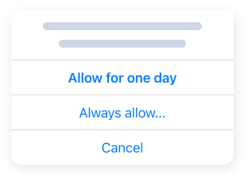

# 📱 Othent Mobile

Othent Mobile is a Safari Web Extension, that allows for an easy & fast
integration of Othent on mobile web apps.&#x20;

## Installation <a href="#installation" id="installation"></a>

Website developers can point Users to download and install Othent Mobile from the AppStore.

Othent uses a pop-up window for the login flow, so users need to disable pop-up blocker in `Settings > Safari`.

Once installed, any user can enable the Extension on any website:

1. Open Safari


2. Tap on the AA icon in the Safari URL bar


3. Tap on "Manage Extensions"


4. Enable "Othent Mobile"


After enabling the extension, users can review permissions for individual sites:

1. iOS shows a "Review Permissions" popup


2. Or users can directly open the extension


3. Select the duration for the permission to grant



After these steps, every website where the extension has been enabled will have a few objects injected into the **`window`** object which can be used by your web apps.

## Usage <a href="#usage" id="usage"></a>

The injected objects in **`window`** object are:

- **`window.othentInstalled`**: `true` when Othent Mobile is enabled, `false` otherwise
- **`window.othentLoaded`**: `true` if the Othent package has been initialized, `false` otherwise
- **`window.initOthent`**: funtion to initialize the Othent object. It receives one optional parameter `params` of type `{ API_ID: string }` to use your developer `API_ID` you get in [othent.io](https://othent.io/). This allows you to differentiate your web app from other developer's web apps
- **`window.othent`**: The actual `othent` object after initialization, `null` if it is not initialized. This object provides you with the API from the <a href="#sdk" id="sdk">SDK</a>. You can use this typescript library outlined in the [🥪 SDK](./sdk.md) docs.

## Example usage

Here's an example on hwo to use the `window.othent` obect injected in the DOM:

### Javascript

```javascript
    const API_ID = "<MY-API-ID>"; // Optional

    const getOthent = () => {

        if (!window.othentInstalled)
            console.log("Please install/enable Othent");

        if (!window.othentLoaded)
            await window.initOthent({API_ID})

        return window.othent;
    }

    const details = await getOthent()?.logIn();
    console.log(details);

```
